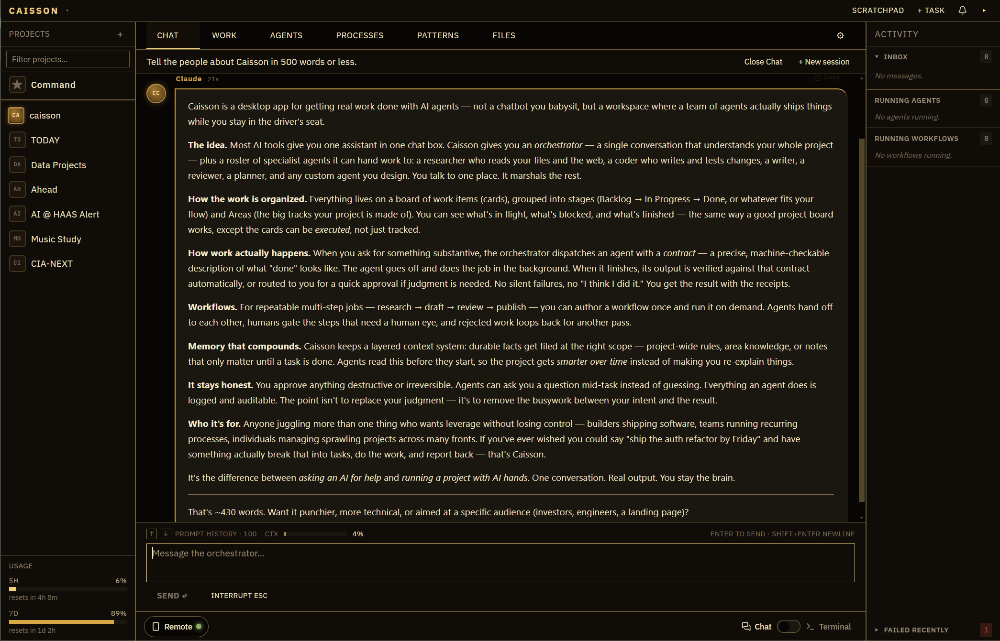

# Caisson

**Build a team of AI specialists that run real work in your real systems.**

[](https://github.com/emersonmccuin-pixel/Caisson/releases/latest)
[](./LICENSE)
[](https://github.com/emersonmccuin-pixel/Caisson/releases/latest)

> ⬇️ **Just want to use it?** Grab the Windows installer from the [latest release](https://github.com/emersonmccuin-pixel/Caisson/releases/latest). It's not code-signed yet, so SmartScreen will warn you — click **More info → Run anyway**.

---



## What it is

Caisson lets you stand up a team of AI specialists and put them to work in the systems you already run — your cloud accounts, your data warehouse, your issue tracker, your codebase. Give a specialist the right access and it operates those systems directly through their APIs: runs the queries, ships the code, files the tickets, provisions the infra, watches for what changed.

You set each one up once, in plain English — what it's expert in, what it can reach, how you want the work done. From then on it carries the load: the planning, the building, the day-to-day admin that used to sit on you. You stay in the loop only where judgment actually matters.

It's not a chat window you start over in every morning. It's a standing team you assemble, direct, and grow — running on your machine, on your own Claude subscription.

## The problem it solves

Real leverage from AI is gated by tech fluency. The people who know how to wire up an MCP server, write a system prompt, and hand a model real API access turn it into a teammate that operates their stack. Everyone else gets a chat box and re-explains their job every session.

Caisson closes that gap. The person who knows the work — the analyst who knows the warehouse, the engineer who knows the codebase, the ops lead who knows the runbook — describes how it should be done, once. Caisson turns that into a specialist that does it, repeatedly, in the real system. The expert becomes the operator.

## What a specialist can be

A specialist is an expert you configure: a focused role, the tools and credentials it needs, and the context that normally lives in your head. A few shapes the same machinery takes:

**A data team.** A Snowflake / Redshift specialist with warehouse credentials, the query tools, and your semantic-layer rules — what "active user" means, where the data lives, how you'd actually answer. It runs the recurring analyses and writes up what changed, without you re-explaining the schema every time.

**A platform / ops team.** Specialists wired into AWS, GCP, and your CI — handling the routine work (provisioning to spec, checking for drift, triaging the standard alerts) and escalating the calls that need a human.

**A build team.** A code-writer that plans, writes, typechecks, and tests a change against a contract, with a reviewer checking the result. A bug or feature goes from a card to a verified diff. *(It's how Caisson builds itself.)*

**A delivery team.** Specialists connected to Jira / Atlassian that triage inbound, groom the board, draft the specs, and run the status roll-ups.

And the lighter end of the same engine: a sales rep whose specialist drafts post-call follow-ups in their voice; an HR coordinator whose onboarding runs itself out into a task tree. **Same tool — the ceiling is as high as the access you give it.** None of these ship as canned templates; you build the team *you* need by describing it.

## A look at it

| The board — work items across stages | A workflow, visualized |
| --- | --- |
|  |  |

| Your roster of specialists | A task, inspected |
| --- | --- |
|  |  |

## How you build it

You have a conversation. An interview walks you through it — for both **specialists** and **workflows**:

- **What is it expert in?** The role, in your words.
- **What can it reach?** The tools, API access, and credentials it needs to operate your systems.
- **What context does it need?** The rules, definitions, and runbook that live in your head.
- **What triggers the work?** A schedule, an external event, a manual run, or a task crossing a stage on the board.
- **What does "done" look like?** Shipped automatically, drafted for your approval, filed as a task, or routed to someone for sign-off.

You answer in plain English. Caisson writes it. Want a change? Tell it — same chat — and it adjusts. No prompts, no YAML, no code.

## How it's put together

| Piece | What it is |
| --- | --- |
| **Specialists** | Expert agents with their own role, model, tools, credentials, and context. Dispatchable, and every run is audited. |
| **Tools & integrations** | How specialists reach the outside world (the MCP tool layer). Hand one the right tools and credentials and it drives that system's API — query a warehouse, open a PR, file a ticket, call a cloud control plane. |
| **Workflows** | A trigger + a series of steps + a verified output. Steps dispatch specialists, call tools, move work across the board, or pause for your sign-off. |
| **Contracts** | Every dispatch carries one: what the output must be and how to check it. "Done" means *verified done*, not assumed — and the output lands where you said it should. |
| **The board** | Tasks are the universal primitive. A workflow run produces a tree of them; the kanban board is one view of that tree. |

## Your starting team

Every project ships with nine built-in specialists as a starting kit. The Project Manager dispatches work to them; edit them, add your own wired to your systems, or promote a good one to use across all your projects.

| Specialist | What it's for |
| --- | --- |
| **researcher** | Investigates on demand — reads files, fetches the web — and writes up findings |
| **writer** | Drafts prose (emails, docs, summaries) in your voice |
| **reviewer** | Critiques drafts, plans, or code against explicit criteria |
| **planner** | Breaks a goal into ordered, verifiable steps |
| **extractor** | Pulls structured data out of messy input |
| **code-writer** | Writes or edits code to spec, then typechecks and tests it |
| **workflow-builder** | Authors and edits your workflows through the build conversation |
| **agent-designer** | Designs new specialists from a plain-language description |
| **caisson** | The in-app guide — explains how Caisson works and adjusts your settings |

## Status — v0.1.0

First published release — pre-1.0, under active development.

- ✅ **Live now:** the project chat, the board, conversational workflow building, the specialist roster, the tool layer, agent dispatch with verified contracts, and the packaged Windows app.
- 🔜 **Maturing:** the external-integration surface (bringing more systems under specialists' control), schedule and event triggers, and full human-in-the-loop review gates — these exist in the model and are being wired into the interface.
- 🪟 **Windows-first.** The macOS build path exists but isn't part of this release.

Schemas and APIs may still change between releases.

## What it costs

Your existing Claude subscription — same login, same plan. Caisson drives the interactive Claude CLI directly. No separate API key, no per-token charge.

## For developers

<details>
<summary>Setup, local run, and desktop builds</summary>

A TypeScript monorepo: an API server (`apps/server`), a React web UI (`apps/web`), an Electron desktop shell (`apps/desktop`), and shared packages for the domain model, database, workflow engine, agent host, and the MCP tool server. Local-first — everything lives in a single SQLite database on your machine.

**Prerequisites:** Node 22 · pnpm 10.33.0 · Git · Claude Code CLI (to run the product end-to-end).

```powershell
git clone https://github.com/emersonmccuin-pixel/Caisson.git
cd Caisson
pnpm install --frozen-lockfile
pnpm typecheck
pnpm build
```

Run locally (API on `http://127.0.0.1:4040`, Vite frontend on `http://127.0.0.1:5173`):

```powershell
pnpm dev
pnpm --filter @pc/web dev
```

Desktop builds:

```powershell
pnpm desktop:dist:dir   # local package smoke
pnpm desktop:dist:win   # Windows installer (built on Windows)
pnpm desktop:dist:mac   # macOS DMG/ZIP (built on macOS, needs Apple signing secrets)
```

</details>

## License

MIT. See [LICENSE](./LICENSE).
