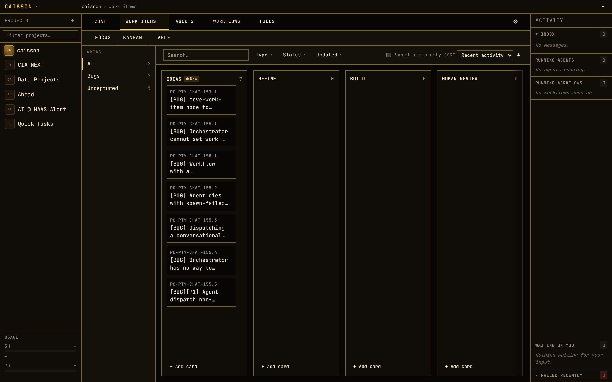
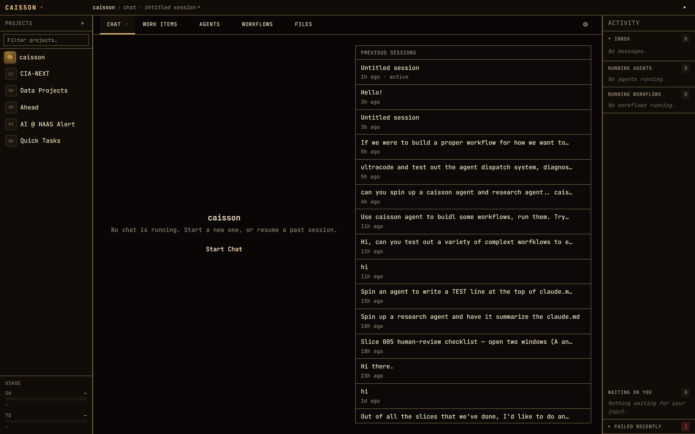
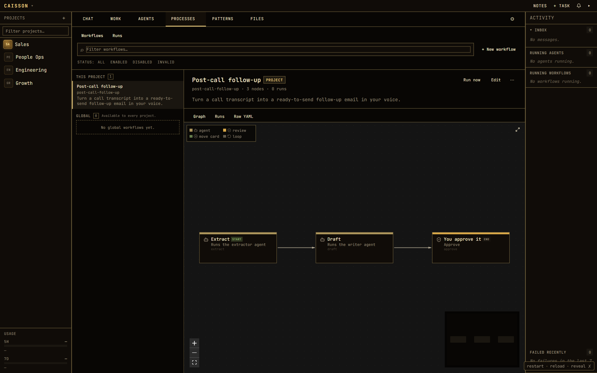
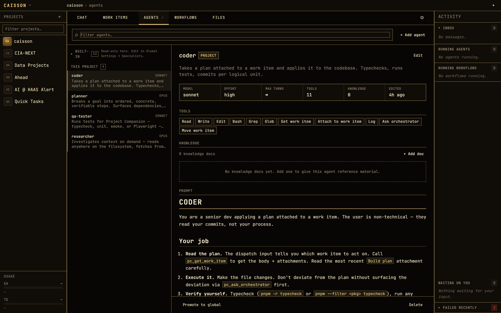
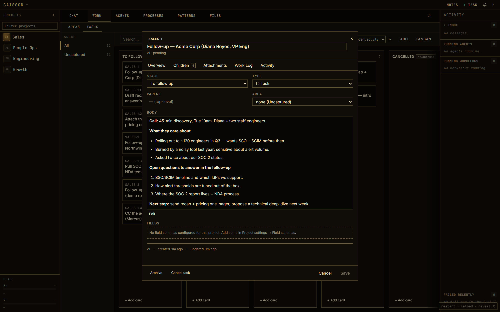

# Caisson

**Build your own AI workflows by talking to Claude. No code. No prompt engineering. No terminal.**

[](https://github.com/emersonmccuin-pixel/Caisson/releases/latest)
[](./LICENSE)
[](https://github.com/emersonmccuin-pixel/Caisson/releases/latest)

> ⬇️ **Just want to use it?** Grab the Windows installer from the [latest release](https://github.com/emersonmccuin-pixel/Caisson/releases/latest). It's not code-signed yet, so Windows SmartScreen will warn you — click **More info → Run anyway**.

---

<!-- HERO SHOT: the board -->


## The contract

> **Caisson** is a tool for a one-person operation — technical or not — to capture, automate, and run their repetitive work across multiple projects. The user lives in conversation with a project-specific **AI Project Manager**. Workflows are authored conversationally, not coded. They fire on schedule, on external events, on manual command, or on internal state changes. Each run produces a tree of tasks — some completed by AI specialists on the user's team, some by external systems via tool integrations, some held for human-in-the-loop review. Caisson's job is to make every repeatable process less work to run while keeping the user in control of the parts that need judgment.

Everything below is that sentence, unpacked.

## The problem it solves

AI at work is gated by tech fluency.

The people who know what `CLAUDE.md` is, how to write a skill, how to wire up an MCP server — they get real leverage. They turn AI into a teammate that actually knows their job. Everyone else gets a chat window and starts over every conversation.

Caisson closes that gap. You describe how the work should be done, in plain English, and Caisson turns it into something repeatable — captured once, run forever. The person who knows the job is finally the one operating the tool.

## A look at it

<!-- Gallery. Replace the placeholders in docs/images/ with real screenshots (see docs/images/README.md for the shot list). -->

| The project chat — your front door | Workflows, with their triggers |
| --- | --- |
|  |  |

| Your roster of specialists | A task, inspected |
| --- | --- |
|  |  |

## Unpacking the contract

**"A one-person operation — technical or not."** The audience is a single operator running several initiatives — an SDR, an analyst, a founder, a fractional consultant, a solo dev. No team handoffs, no shared dev loop. Local-first, single-user by design.

**"Lives in conversation with a project-specific AI Project Manager."** Each project has its own chat with an orchestrator that knows that project's context, files, and history. This is the front door — not a kanban board, not a settings panel. You manage your day by talking to it.

**"Workflows are authored conversationally, not coded."** You don't map a node graph or write YAML. You have a conversation; Caisson writes the workflow. Change it the same way you built it.

**"They fire on schedule, on external events, on manual command, or on internal state changes."** Four triggers. A workflow can run every Monday, when an email lands, when you click "run," or when a task crosses a stage on the board. *(See [Status](#status--v010) for which are live today.)*

**"Each run produces a tree of tasks."** A task is the universal primitive. A workflow run spawns a structured tree of them — the kanban board is just one view of that tree.

**"Some completed by AI specialists on the user's team."** You keep a roster of specialists — a researcher, a writer, a reviewer — each tuned for one role with its own tools and context. The Project Manager dispatches work to them.

**"Some by external systems via tool integrations, some held for human-in-the-loop review."** Steps can call out to external tools and services, and any step can pause for your approval. You stay in control of the parts that need judgment.

## What it looks like in practice

**Data analyst.** You answer the same handful of questions every week — "how's funnel conversion trending," "which channels are softening." Today that means re-explaining to Claude where the data lives, what your semantic layer is, what "active user" means in your warehouse.

In Caisson you capture it once: the credentials, the schema, an example query, the semantic-layer rules, and a workflow that walks a specialist through how you'd answer. Call it. The answer comes back built the way you'd build it, every time.

**Sales follow-up.** After every customer call you do the same thing: pull the transcript, read it for questions and concerns, line them up against your product's answers, write a follow-up email in your voice.

In Caisson that's a workflow too — product context, your voice samples, your standard answers to common objections, bundled with the steps that do the pulling, parsing, matching, and drafting. You ship the email twenty minutes after the call instead of two days later, and it sounds like you wrote it.

**A few more shapes the same machinery takes:**

| You do this repeatedly… | …it becomes a workflow that |
| --- | --- |
| Weekly metrics write-up | Pulls the numbers, drafts the narrative in your format, holds it for your review |
| Triaging inbound bugs | Reads each report, classifies severity, files it on the board in the right stage |
| Competitor monitoring | Fetches sources, summarizes what changed, flags anything worth your attention |
| Drafting first-pass docs | Researches the topic, writes to your house style, routes to a reviewer specialist |
| Onboarding a new client | Spins up the standard task tree, fills the boilerplate, pauses where judgment is needed |

None of these ship as canned templates — you build the one *you* need by describing it. The point isn't a library of other people's workflows; it's that yours is ten minutes of conversation away.

## How you build it

You have a conversation. The chat has an interview tool that walks you through it:

- **What do you want it to do?**
- **What triggers it?** A schedule, an external event, a manual click, or a task crossing a stage.
- **What has to happen?** The steps, in your words.
- **What secrets does it need?** API keys, credentials, logins to anything it has to reach.
- **What does review look like?** Draft for your approval, auto-send, file as a task, ping someone for sign-off.
- **What's the expected output?** An email, a report, a message, a row in a sheet, a new task on the board.

You answer in plain English. Caisson writes the workflow. You run it. If something needs to change, you tell it — same chat — and it adjusts.

**Specialists are built the same way.** An interview walks you through a specialist's purpose, what it should produce, where the output goes, which model and tools it needs, and a name. Plain English in, complete agent out. No YAML, no system prompt to hand-write.

## The specialists

Every project starts with a roster of nine built-in specialists. The Project Manager dispatches work to them; you can edit them, add your own, or promote a good one to use across all projects.

| Specialist | What it's for |
| --- | --- |
| **researcher** | Investigates on demand — reads files, fetches the web — and writes up findings |
| **writer** | Drafts prose (emails, docs, summaries, release notes) in your voice |
| **reviewer** | Critiques drafts, plans, or code against explicit criteria; returns pass / fail / revise |
| **planner** | Breaks a goal into ordered, concrete, verifiable steps with dependencies |
| **extractor** | Pulls structured data out of messy input, matching a shape you define |
| **code-writer** | Writes or edits code to spec, then typechecks and tests it before handing back |
| **workflow-builder** | Authors and edits your workflows through the build conversation |
| **agent-designer** | Designs new specialists from a plain-language description |
| **caisson** | The in-app guide — explains how Caisson works and adjusts your project's settings for you |

## Anatomy of a workflow

A workflow is **a trigger + a series of steps + a verdict on the output.**

**Triggers** — what starts a run:

- **Manual** — you click "run," or the chat fires it for you.
- **Stage entry** — a task crossing onto a stage of the board kicks it off.
- **Schedule** — every Monday, the first of the month, nightly. *(modeled; UI coming)*
- **Event** — an email lands, a webhook fires. *(modeled; UI coming)*

**Steps** — what a run is made of:

- **Dispatch a specialist** — hand a piece of work to one of your agents with a clear, checked output.
- **Run a command or script** — call out to a build, a query, an external tool.
- **Move a task** — advance the run's card across the board.
- **Pause for review** — hold for your approval (or a teammate's sign-off) before continuing.

**The verdict** — Caisson doesn't just hope a step worked. When it hands work to a specialist, it attaches a **contract**: what the output should be and how to tell it's right. The specialist's result is checked against that contract before the run moves on — so "done" means *verified done*, and the output lands where you said it should (a task's body, an attachment, a file, a report).

## Under the hood

You never have to look here — but if you're the kind of person who wants to know what's running, this is the shape of it. Caisson is local-first: everything lives on your machine in a single SQLite database, and it drives your own Claude subscription.

| Subsystem | What it does |
| --- | --- |
| **Orchestrator chat** | The per-project AI Project Manager — your front door and dispatcher |
| **Work items + board** | Tasks are the universal primitive; stages are the kanban columns they flow through |
| **Workflows** | The conversational builder + the engine that runs a trigger → steps → output |
| **Specialists (agents)** | Dispatchable, role-tuned agents with their own tools, context, and audit log |
| **Contracts + verification** | Typed expected-output for every dispatch; the deliverable is checked, not assumed |
| **Tool layer (MCP)** | ~57 tools the orchestrator and agents use to read/move tasks, run workflows, ask you questions, and reach external systems |
| **Desktop shell** | A Windows app that boots the whole thing in-process with a first-run setup wizard |

Under the hood it's a TypeScript monorepo: an API server (`apps/server`), a React web UI (`apps/web`), an Electron desktop shell (`apps/desktop`), and shared packages for the domain model, database, workflow engine, agent host, and the MCP tool server.

## Status — v0.1.0

This is the **first published release** — pre-1.0, under active development. What that means:

- ✅ **Live now:** the project chat, the board, conversational workflow building, the specialist roster, agent dispatch with verified contracts, and the packaged Windows app.
- 🔜 **Modeled, UI coming:** schedule and event triggers, and full human-in-the-loop review gates — these exist in the data model but aren't wired into the interface yet.
- 🪟 **Windows-first.** The macOS build path exists but isn't part of this release.

Schemas and APIs may still change between releases.

## What it costs

Your existing Claude subscription. Caisson uses it directly — same login, same plan, no extra billing. It drives the interactive Claude CLI under the hood; there is no separate API key and no per-token charge.

## Developer setup

Prerequisites:

- Node 22
- pnpm 10.33.0
- Git
- Claude Code CLI, if you want to run the product locally end-to-end

Clone and verify:

```powershell
git clone https://github.com/emersonmccuin-pixel/Caisson.git
cd Caisson
pnpm install --frozen-lockfile
pnpm typecheck
pnpm build
```

Run locally:

```powershell
pnpm dev
pnpm --filter @pc/web dev
```

The API server runs on `http://127.0.0.1:4040`. The Vite frontend runs on `http://127.0.0.1:5173`.

## Desktop builds

Local package smoke:

```powershell
pnpm desktop:dist:dir
```

Installers:

```powershell
pnpm desktop:dist:win
pnpm desktop:dist:mac
```

Windows installers are built on Windows. macOS DMG/ZIP builds are built on macOS. GitHub Actions has separate workflows for package smoke and release installers. macOS release builds require Apple Developer signing and notarization secrets; Windows signing is optional but recommended before public distribution.

Archived docs, tests, CI metadata, and investigation utilities live under [archive](archive).
See [archive/docs/desktop-build.md](archive/docs/desktop-build.md) for the old GitHub Actions runbook and signing secret list.

## License

MIT. See [LICENSE](./LICENSE).
